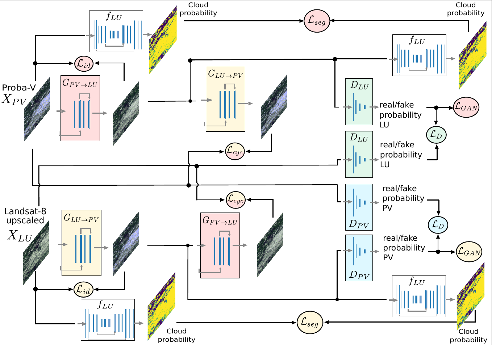
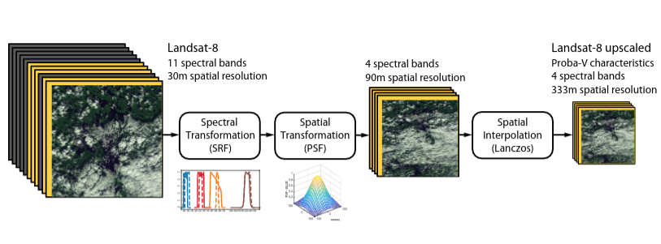

# Landsat-8 to Proba-V Transfer Learning and Domain Adaptation for Cloud detection

This repo contains the code of publication: 

> [1] G. Mateo-Garcia, V. Laparra, D. Lopez-Puigdollers, and L. Gomez-Chova, “Cross-Sensor Adversarial Domain Adaptation of Landsat-8 and Proba-V images for Cloud Detection,” IEEE Journal of Selected Topics in Applied Earth Observations and Remote Sensing, pp. 1–1, 2020, doi: 10.1109/JSTARS.2020.3031741. [paper](https://doi.org/10.1109/JSTARS.2020.3031741)

Additional results can be found at https://isp.uv.es/projects/cloudsat/pvl8dagans

## Requirements

The following code creates a new conda virtual environment with required dependencies.

```bash
conda create -n pvl8 -c conda-forge python=3.7 matplotlib 'pillow<7' numpy scipy libgdal=2.3 pandas tensorflow=2 --y

conda activate pvl8

pip install rasterio tifffile spectral tqdm luigi 

pip install h5py --ignore-installed --no-deps # To use pip h5py otherwise szip compression used in Proba-V cannot be read
```

## Train proposed Adversarial Domain Adaptation 



First, download the *Biome Proba-V pseudo-simultaneous dataset* from [here](https://gigatron.uv.es/owncloud/index.php/s/F6T9eM1wDDp7vVG). Then run:

```
python main_cycle_gans_da.py TrainCycleGAN --dataset-folder /folder/with/hdf5/file/ --suffix full --folder /path/to/save/models
```

## Inference Adversarial Domain Adaptation

Apply the DA transformation [2] to a new Proba-V image. A level 2A 333M Proba-V image is required, it can be downloaded from the [VITO portal](http://www.vito-eodata.be/PDF/portal/Application.html).
By default it uses the pretrained models from the `checkpoints` folder. See `--cloud-detection-weights` and `--dagans-weights` attributes.

```
python inference_da.py InferenceDA --pvimage PROBAV_L2A_20140321_150455_3_333M_V101.HDF5 --image-dest PROBAV_L2A_20140321_150455_3_333M_V101_ADAPTED.HDF5
```

The generated product contains the modified Proba-V bands and the cloud mask stored in `CM_DAGANS` dataset of the HDF5 file. 

## Transform Landsat-8 image to Proba-V following the physically based transformation



This is the Landsat-8 to Proba-V transformation first proposed in:

>[2] G. Mateo-García, V. Laparra, D. López-Puigdollers, and L. Gómez-Chova, "Transferring deep learning models for cloud detection between Landsat-8 and Proba-V", ISPRS Journal of Photogrammetry and Remote Sensing, vol. 160, pp. 1–17, Feb. 2020, doi: 10.1016/j.isprsjprs.2019.11.024. [paper](https://www.sciencedirect.com/science/article/abs/pii/S0924271619302801)

It requires a L1T Landsat-8 image that could be downloaded from the [EarthExplorer](https://earthexplorer.usgs.gov/). 
The `--l8img` attribute points to the unzipped folder with TIF images for each band.

```
python convert_landsat_probav.py ConvertPV --l8img LC08_L1TP_002054_20160520_20170324_01_T1 --outfolder folder/save/product/
```

Additionally it also accepts an image with its manually annotated cloud mask from the [Biome dataset](https://landsat.usgs.gov/landsat-8-cloud-cover-assessment-validation-data) or from the [38-clouds dataset](https://www.kaggle.com/sorour/38cloud-cloud-segmentation-in-satellite-images).

```
python convert_landsat_probav.py ConvertPV --l8img BC/LC80010112014080LGN00 --type-product biome --outfolder folder/save/product/
```

## Cite

If you use this work please cite:

```
@article{mateo-garcia_cross-sensor_2020,
	title = {Cross-{Sensor} {Adversarial} {Domain} {Adaptation} of {Landsat}-8 and {Proba}-{V} images for {Cloud} {Detection}},
	issn = {2151-1535},
	doi = {10.1109/JSTARS.2020.3031741},
	journal = {IEEE Journal of Selected Topics in Applied Earth Observations and Remote Sensing},
	author = {Mateo-Garcia, G. and Laparra, V. and Lopez-Puigdollers, D. and Gomez-Chova, L.},
	year = {2020},
	pages = {1--1},
}
 @article{mateo-garcia_transferring_2020,
	title = {Transferring deep learning models for cloud detection between {Landsat}-8 and {Proba}-{V}},
	volume = {160},
	issn = {0924-2716},
	doi = {10.1016/j.isprsjprs.2019.11.024},
	journal = {ISPRS Journal of Photogrammetry and Remote Sensing},
	author = {Mateo-García, Gonzalo and Laparra, Valero and López-Puigdollers, Dan and Gómez-Chova, Luis},
	month = feb,
	year = {2020},
	pages = {1--17},
}
```
## Related work

* [Benchmarking Deep Learning Models for Cloud Detection in Landsat-8 and Sentinel-2](https://github.com/IPL-UV/DL-L8S2-UV)
* [Multitemporal cloud masking in the Google Earth Engine](https://github.com/IPL-UV/ee_ipl_uv)
